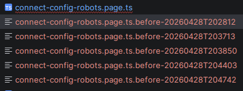

# regres


Narzędzia do analizy regresji, refaktoryzacji i duplikatów kodu — z naciskiem na **autonomiczne wykrywanie regresji frontendu** (placeholder pages, broken imports, runtime 500 z Vite, niezgodność konwencji loadera modułów) i generowanie skryptów naprawczych z trybami `--preview` / `--diff` / `--apply`.

## Installation

```bash
pip install -e .
```

## What's new (0.1.40)

- **Page-registry compliance check** (`page_registry_default_missing`) — parsuje `<module>/pages-index.ts`, weryfikuje że `defaultPage` istnieje w rejestrze stron (z pominięciem zakomentowanych wpisów). Brak → krytyczna diagnoza z gotową instrukcją naprawy. Wykrywa runtime symptom: tysiące powtórzeń `Page '...' not found, using default` + głęboki stos `base-page-manager.ts:67` (nieskończona rekurencja w fallback do nieistniejącego defaultPage).
- **Module-loader compliance check** (`module_loader_no_class`) — wykrywa pliki `<name>.module.ts`, które nie eksportują klasy `*Module` ani `default`. Bez nich host `frontend/src/modules/index.ts` rzuca runtime: `No Module class found in ./<name>/<name>.module.ts`. Diagnoza pokazuje gotowy fragment `BaseModule` do wklejenia.
- **Vite runtime probe** (`--vite-base`, autoderywowane z `--url`) — pobiera plik celu z dev-servera Vite i parsuje błędy 500 typu `Failed to resolve import "X" from "Y"`. Łańcuchowo dodaje plik źródłowy błędu do kolejki i kontynuuje sondowanie.
- **Dependency chain analysis** — BFS po relatywnych importach pliku celu (depth=1); zaznacza `BROKEN`/`STUB`. Każdy broken link generuje gotową komendę regres do naprawy chained.
- **Decision-tree workflow w raporcie** — README, ścieżka decyzyjna, snapshot struktury, plan kroków (`status`, `inputs`, `outputs`, `decision`).
- **Patch scripts z `--preview` / `--diff` / `--apply`** + automatycznym przepisywaniem ścieżek importów po przywróceniu pliku z innego głębokiego poziomu.
- Nowy mapping `connect-deleted` w `MODULE_PATH_MAP`.

## Usage

Główny CLI `regres` obsługuje następujące komendy:

- `regres` — analiza regresji plików (historia, zmiany)
- `regres refactor` — analiza kodu przy refaktoryzacji (duplikaty, zależności, symbole)
- `regres defscan` — skaner duplikatów definicji klas, funkcji i modeli
- `regres doctor` — orchestrator analizy i generator akcji naprawczych (z trybem URL)
- `regres import-error-toon-report` — raport błędów importów TS w formacie Toon

### Doctor — typowy workflow URL → naprawa

```bash
# 1) Analiza konkretnej strony, która nie wyświetla się poprawnie:
regres doctor \
  --scan-root /path/to/repo \
  --url 'http://localhost:8100/connect-config-sitemap?...' \
  --all --git-history \
  --vite-base http://localhost:8100 \
  --out-md .regres/sitemap-doctor.md

# Raport zawiera:
#   - Plan kroków (decision-tree) z inputs/outputs/decision per krok
#   - Page implementation analysis (placeholder/stub detection)
#   - Module loader compliance (czy <name>.module.ts spełnia kontrakt loadera)
#   - Dependency chain (broken/stub linki w importach celu)
#   - Vite runtime probe (autorytatywny status 200/500 + missing import)
#   - Patch scripts z preview/diff/apply per kandydat z historii git

# 2) Każdy "broken link" w raporcie zawiera gotową komendę regres
#    dla pliku, który zgłosił błąd — wystarczy ją skopiować i uruchomić,
#    aby kontynuować naprawę łańcuchową.

# 3) Po wybraniu kandydata uruchom patch script:
bash .regres/patches/<page-token>/restore-<hash>.sh --preview   # podgląd
bash .regres/patches/<page-token>/restore-<hash>.sh --diff      # diff
bash .regres/patches/<page-token>/restore-<hash>.sh --apply     # zapis
```

### Examples

```bash
# Analiza regresji pliku
regres regres --file path/to/file.py

# Analiza kodu przy refaktoryzacji
regres refactor find encoder
regres refactor symbols encoder
regres refactor duplicates

# Skan duplikatów definicji
regres defscan
regres defscan --kind class --min-count 2

# Orchestrator analizy i generator akcji naprawczych
regres doctor --all
regres doctor --import-log .regres/import-error-toon-report.raw.log --out-md .regres/doctor-report.md
regres doctor --url http://localhost:8100/connect-deleted --vite-base http://localhost:8100

# Raport błędów importów TS
regres import-error-toon-report
```

## Diagnozy `doctor` — typy

| `problem_type`               | Severity   | Wykrycie |
|-----------------------------|------------|----------|
| `page_content_regression`   | high       | git history pokazuje znacznie większą poprzednią wersję pliku |
| `placeholder_page`          | high       | tekst pasuje do `PLACEHOLDER_TEXT_PATTERNS` |
| `import_resolution_failure` | high/medium| BFS po relatywnych importach — nie rozwiązany / placeholder |
| `vite_runtime_failure`      | critical   | HTTP probe Vite zwraca 500 z `Failed to resolve import` |
| `module_loader_no_class`    | critical   | `<name>.module.ts` bez `*Module` / `export default` |
| `page_registry_default_missing` | critical | `pages-index.ts` ma `defaultPage` nieobecny w rejestrze → ryzyko nieskończonej rekurencji w `BasePageManager` |
| `module_not_found`          | medium     | URL prefix bez modułu w `MODULE_PATH_MAP` |
| `import_error`              | medium     | TS2307/TS2305 z logu kompilatora |

## Documentation

- [REGRES](docs/REGRES.md) — analiza regresji plików
- [REFACTOR](docs/REFACTOR.md) — analiza kodu przy refaktoryzacji
- [DEFSCAN](docs/DEFSCAN.md) — skaner duplikatów definicji
- [DOCTOR](docs/DOCTOR.md) — orchestrator analizy i generator akcji naprawczych
- [import-error-toon-report](docs/import-error-toon-report.md) — raport błędów importów TS

## AI Cost Tracking

   
  

- 🤖 **LLM usage:** $6.0000 (40 commits)
- 👤 **Human dev:** ~$838 (8.4h @ $100/h, 30min dedup)

Generated on 2026-04-28 using [openrouter/qwen/qwen3-coder-next](https://openrouter.ai/qwen/qwen3-coder-next)

---

## License

Licensed under Apache-2.0.
