# System Architecture Analysis

## Overview

- **Project**: /home/tom/github/semcod/regres
- **Primary Language**: md
- **Languages**: md: 14, python: 12, yaml: 9, shell: 2, txt: 1
- **Analysis Mode**: static
- **Total Functions**: 1322
- **Total Classes**: 19
- **Modules**: 40
- **Entry Points**: 1151

## Architecture by Module

### SUMD
- **Functions**: 626
- **Classes**: 5
- **File**: `SUMD.md`

### project.map.toon
- **Functions**: 409
- **File**: `map.toon.yaml`

### SUMR
- **Functions**: 217
- **Classes**: 5
- **File**: `SUMR.md`

### regres.doctor_orchestrator
- **Functions**: 66
- **Classes**: 1
- **File**: `doctor_orchestrator.py`

### regres.regres
- **Functions**: 55
- **Classes**: 1
- **File**: `regres.py`

### regres.refactor
- **Functions**: 52
- **File**: `refactor.py`

### regres.defscan
- **Functions**: 45
- **Classes**: 1
- **File**: `defscan.py`

### regres.import_error_toon_report
- **Functions**: 13
- **Classes**: 2
- **File**: `import_error_toon_report.py`

### regres.version_check
- **Functions**: 10
- **File**: `version_check.py`

### regres.regres_cli
- **Functions**: 9
- **File**: `regres_cli.py`

### regres.doctor_cli
- **Functions**: 9
- **File**: `doctor_cli.py`

### docs.DOCTOR
- **Functions**: 1
- **Classes**: 1
- **File**: `DOCTOR.md`

### docs.DEFSCAN
- **Functions**: 1
- **File**: `DEFSCAN.md`

### docs.README
- **Functions**: 1
- **File**: `README.md`

### regres.doctor_models
- **Functions**: 0
- **Classes**: 3
- **File**: `doctor_models.py`

## Key Entry Points

Main execution flows into the system:

### regres.regres_cli.main
- **Calls**: regres.version_check.check_version, argparse.ArgumentParser, parser.add_subparsers, subparsers.add_parser, regres_parser.add_argument, regres_parser.add_argument, regres_parser.add_argument, regres_parser.add_argument

### regres.refactor.cmd_hotmap
> Mapa katalogów wg koncentracji podobnych plików.
Wskaźnik 'hotness' = liczba par podobnych / liczba plików w katalogu × 100.
Wysoki hotness = kandydat
- **Calls**: getattr, getattr, regres.refactor.iter_files, list, defaultdict, defaultdict, dir_file_count.items, hotmap.sort

### regres.doctor_orchestrator.DoctorOrchestrator._diagnose_page_stub
> Zwraca diagnozę, jeżeli plik strony to stub/placeholder lub uległa skróceniu.
- **Calls**: sum, text.lower, any, bool, None.replace, self._collect_page_history_candidates, max, self._find_backup_page_implementation

### regres.doctor_orchestrator.DoctorOrchestrator.render_markdown
> Renderuje raport w formacie Markdown.
- **Calls**: lines.extend, lines.extend, lines.extend, lines.extend, enumerate, self._normalize_diagnoses, lines.extend, None.join

### regres.doctor_orchestrator.DoctorOrchestrator._render_decision_workflow
- **Calls**: lines.append, lines.append, enumerate, lines.append, lines.append, lines.append, lines.append, report.get

### regres.refactor.cmd_diff
> Unified diff dwóch plików. Opcja --normalize usuwa komentarze/stringi.
- **Calls**: Path, Path, regres.refactor.read_text, regres.refactor.read_text, getattr, regres.refactor.similarity_ratio, list, docs.DEFSCAN.print

### regres.doctor_orchestrator.DoctorOrchestrator._collect_page_history_candidates
> Zbiera kandydatów z historii git dla danej strony.

Strategia:
1. Wyszukaj wszystkie commity dotyczące plików `*<token>.page.ts`
   w całym repozytori
- **Calls**: set, res.stdout.splitlines, candidates.sort, set, None.exists, subprocess.run, line.strip, None.replace

### regres.doctor_orchestrator.DoctorOrchestrator._render_affected_files
- **Calls**: lines.append, lines.append, report.get, lines.append, lines.append, None.join, lines.append, lines.append

### regres.doctor_orchestrator.DoctorOrchestrator.generate_patch_scripts
> Tworzy `.sh` patche dla każdej opcji w diagnozach.

Zwraca listę metadanych: [{"path": ..., "diagnosis": ..., "candidate": ..., "kind": ...}].
Każdy s
- **Calls**: out_dir.mkdir, enumerate, index_lines.append, index_path.write_text, generated.insert, enumerate, next, self._render_generic_patch_script

### regres.refactor.cmd_dead
> Wykrywa symbole zdefiniowane ale prawdopodobnie nieużywane.
Definicje: pliki z --word.
Sprawdzenie: czy symbol pojawia się jako identyfikator w jakimk
- **Calls**: getattr, regres.refactor.iter_files, regres.refactor.iter_files, defaultdict, set, None.join, defined.items, dead.sort

### regres.refactor.cmd_similar
- **Calls**: getattr, regres.refactor.iter_files, list, range, pairs.sort, docs.DEFSCAN.print, docs.DEFSCAN.print, docs.DEFSCAN.print

### regres.doctor_orchestrator.DoctorOrchestrator._diagnose_import_issue
> Diagnozuje problem z importami i generuje plan naprawy.
- **Calls**: Diagnosis, module.startswith, module.replace, self._resolve_alias_target, commands.append, len, any, actions.append

### regres.refactor.cmd_cluster
- **Calls**: getattr, regres.refactor.iter_files, defaultdict, sorted, docs.DEFSCAN.print, getattr, regres.refactor.read_text, None.append

### regres.regres.main
- **Calls**: argparse.ArgumentParser, parser.add_argument, parser.add_argument, parser.add_argument, parser.add_argument, parser.add_argument, parser.add_argument, parser.add_argument

### regres.refactor.cmd_duplicates
- **Calls**: regres.refactor.iter_files, defaultdict, docs.DEFSCAN.print, enumerate, getattr, None.append, docs.DEFSCAN.print, docs.DEFSCAN.print

### regres.import_error_toon_report.main
- **Calls**: regres.version_check.check_version, regres.import_error_toon_report.parse_args, regres.import_error_toon_report.parse_ts_errors, ReportData, regres.import_error_toon_report.render_markdown, args.out_md.parent.mkdir, args.out_md.write_text, args.out_raw_log.parent.mkdir

### regres.doctor_orchestrator.DoctorOrchestrator._collect_defscan_context
- **Calls**: None.join, io.StringIO, output.strip, defscan.main, sys.stdout.getvalue, json.loads, lines.append, lines.append

### regres.refactor.cmd_find
- **Calls**: regres.refactor.iter_files, results.sort, docs.DEFSCAN.print, docs.DEFSCAN.print, docs.DEFSCAN.print, docs.DEFSCAN.print, regres.refactor.read_text, regres.refactor.count_word

### regres.refactor.cmd_symbols
> Indeks symboli (funkcje, klasy, selektory CSS, id HTML…).

--cross-lang   → ta sama nazwa symbolu w więcej niż jednym języku
--find-dups    → ta sama 
- **Calls**: getattr, getattr, regres.refactor.iter_files, regres.refactor._build_symbol_index, regres.refactor._render_file_symbols, getattr, getattr, sorted

### regres.refactor.cmd_wrappers
> Wykrywa cienkie pliki-wrappery / legacy shims / barrel files.
Heurystyki: krótkie + sys.path + dynamic import + barrel export + sygnatury tekstowe.
- **Calls**: getattr, regres.refactor.iter_files, results.sort, docs.DEFSCAN.print, docs.DEFSCAN.print, docs.DEFSCAN.print, docs.DEFSCAN.print, getattr

### regres.doctor_orchestrator.DoctorOrchestrator.analyze_from_url
> Analizuje moduł na podstawie URL.
- **Calls**: self._extract_module_name, self._resolve_module_path, diagnoses.extend, diagnoses.extend, diagnoses.extend, full_module_path.rglob, self._filter_actionable_diagnoses, self._build_url_fallback_diagnosis

### regres.doctor_orchestrator.DoctorOrchestrator._render_step_by_step_playbook
> Renderuje playbook krok po kroku.
- **Calls**: enumerate, lines.append, lines.append, diag.get, diag.get, sorted, lines.append, lines.append

### regres.refactor.cmd_report
> Generuje kompleksowy raport JSON dla LLM.
- **Calls**: getattr, getattr, getattr, docs.DEFSCAN.print, regres.refactor.iter_files, regres.refactor._collect_file_infos, regres.refactor._find_md5_duplicates, regres.refactor._find_name_clusters

### regres.doctor_orchestrator.DoctorOrchestrator._render_apply_step
- **Calls**: lines.append, lines.append, lines.append, lines.append, lines.append, lines.append, lines.append, lines.append

### regres.doctor_orchestrator.DoctorOrchestrator._build_url_fallback_diagnosis
> Create a targeted guidance diagnosis when no actionable findings were generated.
- **Calls**: Diagnosis, route_path.replace, token.strip, module_path.rglob, list, FileAction, ShellCommand, route_path.split

### regres.doctor_orchestrator.DoctorOrchestrator.generate_llm_diagnosis
> Generuje szczegółowy raport markdown z kontekstem historycznym i strukturalnym.
- **Calls**: None.join, self._build_header, self._build_section, self._build_section, self._build_section, self._build_section, self._build_nlp_diagnosis, self._build_proposed_fixes

### regres.doctor_orchestrator.DoctorOrchestrator._resolve_alias_target
> Próbuje znaleźć rzeczywistą ścieżkę dla aliasu @c2004/*.
- **Calls**: alias_path.replace, cand.exists, None.exists, None.replace, None.exists, None.replace, None.replace, str

### regres.defscan.main
- **Calls**: regres.defscan._build_argument_parser, parser.parse_args, None.resolve, str, regres.defscan.load_gitignore, root.exists, docs.DEFSCAN.print, sys.exit

### regres.doctor_orchestrator.DoctorOrchestrator._fingerprint_page_content
> Krótki opis zawartości — wyciąga znaczące nagłówki/tytuły z HTML/string.
- **Calls**: re.finditer, re.finditer, keywords.append, keywords.append, None.join, None.strip, len, None.strip

### regres.doctor_orchestrator.DoctorOrchestrator._build_missing_page_diagnosis
> Diagnoza dla URL nie mającego pliku strony w module.
- **Calls**: None.replace, self._find_backup_page_implementation, Diagnosis, module_path.relative_to, FileAction, ShellCommand, None.replace, actions.append

## Process Flows

Key execution flows identified:

### Flow 1: main
```
main [regres.regres_cli]
  └─ →> check_version
      └─> _get_pypi_version
      └─> _save_last_check
          └─> _read_env
```

### Flow 2: cmd_hotmap
```
cmd_hotmap [regres.refactor]
  └─> iter_files
```

### Flow 3: _diagnose_page_stub
```
_diagnose_page_stub [regres.doctor_orchestrator.DoctorOrchestrator]
```

### Flow 4: render_markdown
```
render_markdown [regres.doctor_orchestrator.DoctorOrchestrator]
```

### Flow 5: _render_decision_workflow
```
_render_decision_workflow [regres.doctor_orchestrator.DoctorOrchestrator]
```

### Flow 6: cmd_diff
```
cmd_diff [regres.refactor]
  └─> read_text
  └─> read_text
```

### Flow 7: _collect_page_history_candidates
```
_collect_page_history_candidates [regres.doctor_orchestrator.DoctorOrchestrator]
```

### Flow 8: _render_affected_files
```
_render_affected_files [regres.doctor_orchestrator.DoctorOrchestrator]
```

### Flow 9: generate_patch_scripts
```
generate_patch_scripts [regres.doctor_orchestrator.DoctorOrchestrator]
```

### Flow 10: cmd_dead
```
cmd_dead [regres.refactor]
  └─> iter_files
  └─> iter_files
```

## Key Classes

### regres.doctor_orchestrator.DoctorOrchestrator
> Orchestrator analizy i generator akcji.
- **Methods**: 66
- **Key Methods**: regres.doctor_orchestrator.DoctorOrchestrator.__init__, regres.doctor_orchestrator.DoctorOrchestrator.analyze_from_url, regres.doctor_orchestrator.DoctorOrchestrator.analyze_page_implementations, regres.doctor_orchestrator.DoctorOrchestrator._extract_page_token, regres.doctor_orchestrator.DoctorOrchestrator._find_page_files, regres.doctor_orchestrator.DoctorOrchestrator._diagnose_page_stub, regres.doctor_orchestrator.DoctorOrchestrator._collect_page_history_candidates, regres.doctor_orchestrator.DoctorOrchestrator._fingerprint_page_content, regres.doctor_orchestrator.DoctorOrchestrator._find_backup_page_implementation, regres.doctor_orchestrator.DoctorOrchestrator._build_missing_page_diagnosis

### regres.defscan.Definition
> Pojedyncza definicja (klasa / funkcja / enum / interface / mixin).
- **Methods**: 3
- **Key Methods**: regres.defscan.Definition.__init__, regres.defscan.Definition.loc, regres.defscan.Definition.__repr__

### docs.DOCTOR.DoctorOrchestrator
- **Methods**: 0

### regres.regres.GitCommit
- **Methods**: 0

### regres.doctor_models.FileAction
> Akcja na pliku.
- **Methods**: 0

### regres.doctor_models.ShellCommand
> Polecenie shell do wykonania.
- **Methods**: 0

### regres.doctor_models.Diagnosis
> Diagnoza problemu i plan naprawy.
- **Methods**: 0

### regres.import_error_toon_report.TsError
- **Methods**: 0

### regres.import_error_toon_report.ReportData
- **Methods**: 0

### SUMR.GitCommit
- **Methods**: 0

### SUMR.DoctorOrchestrator
- **Methods**: 0

### SUMR.Definition
- **Methods**: 0

### SUMR.TsError
- **Methods**: 0

### SUMR.ReportData
- **Methods**: 0

### SUMD.GitCommit
- **Methods**: 0

### SUMD.DoctorOrchestrator
- **Methods**: 0

### SUMD.Definition
- **Methods**: 0

### SUMD.TsError
- **Methods**: 0

### SUMD.ReportData
- **Methods**: 0

## Data Transformation Functions

Key functions that process and transform data:

### regres.regres.parse_numstat_block
- **Output to**: None.split, a.isdigit, d.isdigit, len, int

### regres.version_check._parse_version
- **Output to**: tuple, int, v.split, x.isdigit

### regres.refactor._format_imports
> Format imports list for toon output.
- **Output to**: None.strip, None.strip, None.join, regres.refactor._sanitize, str

### regres.refactor._format_preview
> Format preview text for toon output.
- **Output to**: regres.refactor._sanitize, len, isinstance

### regres.refactor.build_parser
- **Output to**: argparse.ArgumentParser, p.add_argument, p.add_argument, p.add_argument, p.add_subparsers

### regres.import_error_toon_report.parse_args
- **Output to**: argparse.ArgumentParser, parser.add_argument, parser.add_argument, parser.add_argument, parser.add_argument

### regres.import_error_toon_report.parse_ts_errors
- **Output to**: log_text.splitlines, TS_ERROR_RE.match, m.group, m.group, MISSING_MODULE_RE.search

### regres.defscan._build_argument_parser
> Build and return the argument parser for defscan.
- **Output to**: argparse.ArgumentParser, parser.add_argument, parser.add_argument, parser.add_argument, parser.add_argument

### project.map.toon._build_argument_parser

### project.map.toon._build_parser

### project.map.toon.parse_args

### project.map.toon.parse_ts_errors

### project.map.toon._format_imports

### project.map.toon._format_preview

### project.map.toon.build_parser

### project.map.toon.parse_numstat_block

### project.map.toon._parse_version

### project.map.toon.test_build_parser

### project.map.toon.test_parser_scan_root

### project.map.toon.test_parser_all

### project.map.toon.test_parser_url

### project.map.toon.test_parser_llm

### project.map.toon.test_parser_import_log

### project.map.toon.test_parser_defscan_report

### project.map.toon.test_parser_apply

## Behavioral Patterns

### recursion__collect_tree_paths
- **Type**: recursion
- **Confidence**: 0.90
- **Functions**: regres.regres._collect_tree_paths

## Public API Surface

Functions exposed as public API (no underscore prefix):

- `regres.defscan.render_text` - 55 calls
- `regres.refactor.build_parser` - 49 calls
- `regres.regres_cli.main` - 48 calls
- `regres.refactor.cmd_hotmap` - 42 calls
- `regres.defscan.render_seed_text` - 42 calls
- `regres.defscan.render_markdown` - 35 calls
- `regres.doctor_orchestrator.DoctorOrchestrator.render_markdown` - 35 calls
- `regres.regres.llm_context_packet` - 33 calls
- `regres.defscan.extract_go` - 32 calls
- `regres.refactor.cmd_diff` - 31 calls
- `regres.import_error_toon_report.to_toon_global_payload` - 31 calls
- `regres.doctor_orchestrator.DoctorOrchestrator.generate_patch_scripts` - 29 calls
- `regres.regres.trace_name_and_hash_candidates` - 28 calls
- `regres.refactor.cmd_dead` - 28 calls
- `regres.refactor.cmd_similar` - 26 calls
- `regres.regres.analyze_file` - 25 calls
- `regres.refactor.cmd_cluster` - 25 calls
- `regres.regres.exact_and_near_duplicates` - 24 calls
- `regres.regres.main` - 24 calls
- `regres.regres.resolve_target_file` - 23 calls
- `regres.import_error_toon_report.render_markdown` - 23 calls
- `regres.regres.resolve_import_historical` - 22 calls
- `regres.regres.resolve_import_at_commit` - 21 calls
- `regres.regres.render_markdown` - 20 calls
- `regres.refactor.wrapper_score` - 20 calls
- `regres.refactor.cmd_duplicates` - 20 calls
- `regres.import_error_toon_report.main` - 20 calls
- `regres.refactor.cmd_find` - 19 calls
- `regres.refactor.cmd_symbols` - 19 calls
- `regres.refactor.cmd_wrappers` - 19 calls
- `regres.defscan.render_seed_markdown` - 19 calls
- `regres.doctor_orchestrator.DoctorOrchestrator.analyze_from_url` - 19 calls
- `regres.regres.check_imports_at_commit` - 18 calls
- `regres.regres.classify_problem` - 18 calls
- `regres.refactor.cmd_report` - 18 calls
- `regres.regres.analyze_evolution` - 17 calls
- `regres.version_check.check_version` - 17 calls
- `regres.import_error_toon_report.parse_ts_errors` - 17 calls
- `regres.defscan.extract_typescript` - 17 calls
- `regres.regres.content_metrics` - 16 calls

## System Interactions

How components interact:

```mermaid
graph TD
    main --> check_version
    main --> ArgumentParser
    main --> add_subparsers
    main --> add_parser
    main --> add_argument
    cmd_hotmap --> getattr
    cmd_hotmap --> iter_files
    cmd_hotmap --> list
    cmd_hotmap --> defaultdict
    _diagnose_page_stub --> sum
    _diagnose_page_stub --> lower
    _diagnose_page_stub --> any
    _diagnose_page_stub --> bool
    _diagnose_page_stub --> replace
    render_markdown --> extend
    render_markdown --> enumerate
    _render_decision_wor --> append
    _render_decision_wor --> enumerate
    cmd_diff --> Path
    cmd_diff --> read_text
    cmd_diff --> getattr
    _collect_page_histor --> set
    _collect_page_histor --> splitlines
    _collect_page_histor --> sort
    _collect_page_histor --> exists
    _render_affected_fil --> append
    _render_affected_fil --> get
    generate_patch_scrip --> mkdir
    generate_patch_scrip --> enumerate
    generate_patch_scrip --> append
```



## Reverse Engineering Guidelines

1. **Entry Points**: Start analysis from the entry points listed above
2. **Core Logic**: Focus on classes with many methods
3. **Data Flow**: Follow data transformation functions
4. **Process Flows**: Use the flow diagrams for execution paths
5. **API Surface**: Public API functions reveal the interface

## Context for LLM

Maintain the identified architectural patterns and public API surface when suggesting changes.