# System Architecture Analysis

## Overview

- **Project**: /home/tom/github/semcod/regres
- **Primary Language**: md
- **Languages**: md: 13, python: 11, yaml: 9, shell: 2, txt: 1
- **Analysis Mode**: static
- **Total Functions**: 879
- **Total Classes**: 21
- **Modules**: 38
- **Entry Points**: 734

## Architecture by Module

### SUMD
- **Functions**: 431
- **Classes**: 7
- **File**: `SUMD.md`

### project.map.toon
- **Functions**: 234
- **File**: `map.toon.yaml`

### SUMR
- **Functions**: 197
- **Classes**: 7
- **File**: `SUMR.md`

### regres.regres
- **Functions**: 55
- **Classes**: 1
- **File**: `regres.py`

### regres.refactor
- **Functions**: 52
- **File**: `refactor.py`

### regres.doctor_orchestrator
- **Functions**: 49
- **Classes**: 1
- **File**: `doctor_orchestrator.py`

### regres.defscan
- **Functions**: 38
- **Classes**: 1
- **File**: `defscan.py`

### regres.import_error_toon_report
- **Functions**: 13
- **Classes**: 2
- **File**: `import_error_toon_report.py`

### regres.doctor_cli
- **Functions**: 8
- **File**: `doctor_cli.py`

### docs.DEFSCAN
- **Functions**: 1
- **File**: `DEFSCAN.md`

### regres.regres_cli
- **Functions**: 1
- **File**: `regres_cli.py`

### docs.DOCTOR
- **Functions**: 1
- **Classes**: 1
- **File**: `DOCTOR.md`

### docs.README
- **Functions**: 1
- **File**: `README.md`

### regres.doctor_models
- **Functions**: 0
- **Classes**: 3
- **File**: `doctor_models.py`

## Key Entry Points

Main execution flows into the system:

### regres.regres_cli.main
- **Calls**: argparse.ArgumentParser, parser.add_subparsers, subparsers.add_parser, regres_parser.add_argument, regres_parser.add_argument, regres_parser.add_argument, regres_parser.add_argument, subparsers.add_parser

### regres.refactor.cmd_hotmap
> Mapa katalogów wg koncentracji podobnych plików.
Wskaźnik 'hotness' = liczba par podobnych / liczba plików w katalogu × 100.
Wysoki hotness = kandydat
- **Calls**: getattr, getattr, regres.refactor.iter_files, list, defaultdict, defaultdict, dir_file_count.items, hotmap.sort

### regres.doctor_orchestrator.DoctorOrchestrator.render_markdown
> Renderuje raport w formacie Markdown.
- **Calls**: lines.extend, lines.extend, lines.extend, enumerate, self._normalize_diagnoses, lines.extend, None.join, self._render_decision_workflow

### regres.refactor.cmd_diff
> Unified diff dwóch plików. Opcja --normalize usuwa komentarze/stringi.
- **Calls**: Path, Path, regres.refactor.read_text, regres.refactor.read_text, getattr, regres.refactor.similarity_ratio, list, docs.DEFSCAN.print

### regres.refactor.cmd_dead
> Wykrywa symbole zdefiniowane ale prawdopodobnie nieużywane.
Definicje: pliki z --word.
Sprawdzenie: czy symbol pojawia się jako identyfikator w jakimk
- **Calls**: getattr, regres.refactor.iter_files, regres.refactor.iter_files, defaultdict, set, None.join, defined.items, dead.sort

### regres.refactor.cmd_similar
- **Calls**: getattr, regres.refactor.iter_files, list, range, pairs.sort, docs.DEFSCAN.print, docs.DEFSCAN.print, docs.DEFSCAN.print

### regres.doctor_orchestrator.DoctorOrchestrator._diagnose_import_issue
> Diagnozuje problem z importami i generuje plan naprawy.
- **Calls**: Diagnosis, module.startswith, module.replace, self._resolve_alias_target, commands.append, len, any, actions.append

### regres.refactor.cmd_cluster
- **Calls**: getattr, regres.refactor.iter_files, defaultdict, sorted, docs.DEFSCAN.print, getattr, regres.refactor.read_text, None.append

### regres.regres.main
- **Calls**: argparse.ArgumentParser, parser.add_argument, parser.add_argument, parser.add_argument, parser.add_argument, parser.add_argument, parser.add_argument, parser.add_argument

### regres.doctor_orchestrator.DoctorOrchestrator._render_decision_workflow
- **Calls**: lines.append, lines.append, enumerate, lines.append, lines.append, lines.append, lines.append, report.get

### regres.refactor.cmd_duplicates
- **Calls**: regres.refactor.iter_files, defaultdict, docs.DEFSCAN.print, enumerate, getattr, None.append, docs.DEFSCAN.print, docs.DEFSCAN.print

### regres.doctor_orchestrator.DoctorOrchestrator._collect_defscan_context
- **Calls**: None.join, io.StringIO, output.strip, defscan.main, sys.stdout.getvalue, json.loads, lines.append, lines.append

### regres.refactor.cmd_find
- **Calls**: regres.refactor.iter_files, results.sort, docs.DEFSCAN.print, docs.DEFSCAN.print, docs.DEFSCAN.print, docs.DEFSCAN.print, regres.refactor.read_text, regres.refactor.count_word

### regres.refactor.cmd_symbols
> Indeks symboli (funkcje, klasy, selektory CSS, id HTML…).

--cross-lang   → ta sama nazwa symbolu w więcej niż jednym języku
--find-dups    → ta sama 
- **Calls**: getattr, getattr, regres.refactor.iter_files, regres.refactor._build_symbol_index, regres.refactor._render_file_symbols, getattr, getattr, sorted

### regres.refactor.cmd_wrappers
> Wykrywa cienkie pliki-wrappery / legacy shims / barrel files.
Heurystyki: krótkie + sys.path + dynamic import + barrel export + sygnatury tekstowe.
- **Calls**: getattr, regres.refactor.iter_files, results.sort, docs.DEFSCAN.print, docs.DEFSCAN.print, docs.DEFSCAN.print, docs.DEFSCAN.print, getattr

### regres.doctor_orchestrator.DoctorOrchestrator._render_step_by_step_playbook
> Renderuje playbook krok po kroku.
- **Calls**: enumerate, lines.append, lines.append, diag.get, diag.get, sorted, lines.append, lines.append

### regres.import_error_toon_report.main
- **Calls**: regres.import_error_toon_report.parse_args, regres.import_error_toon_report.parse_ts_errors, ReportData, regres.import_error_toon_report.render_markdown, args.out_md.parent.mkdir, args.out_md.write_text, args.out_raw_log.parent.mkdir, args.out_raw_log.write_text

### regres.refactor.cmd_report
> Generuje kompleksowy raport JSON dla LLM.
- **Calls**: getattr, getattr, getattr, docs.DEFSCAN.print, regres.refactor.iter_files, regres.refactor._collect_file_infos, regres.refactor._find_md5_duplicates, regres.refactor._find_name_clusters

### regres.doctor_orchestrator.DoctorOrchestrator._render_apply_step
- **Calls**: lines.append, lines.append, lines.append, lines.append, lines.append, lines.append, lines.append, lines.append

### regres.doctor_orchestrator.DoctorOrchestrator.analyze_from_url
> Analizuje moduł na podstawie URL.
- **Calls**: self._extract_module_name, self._resolve_module_path, diagnoses.extend, diagnoses.extend, full_module_path.rglob, urlparse, parsed.path.strip, full_module_path.exists

### regres.doctor_orchestrator.DoctorOrchestrator.generate_llm_diagnosis
> Generuje szczegółowy raport markdown z kontekstem historycznym i strukturalnym.
- **Calls**: None.join, self._build_header, self._build_section, self._build_section, self._build_section, self._build_section, self._build_nlp_diagnosis, self._build_proposed_fixes

### regres.doctor_orchestrator.DoctorOrchestrator._resolve_alias_target
> Próbuje znaleźć rzeczywistą ścieżkę dla aliasu @c2004/*.
- **Calls**: alias_path.replace, cand.exists, None.exists, None.replace, None.exists, None.replace, None.replace, str

### regres.defscan.main
- **Calls**: regres.defscan._build_argument_parser, parser.parse_args, None.resolve, str, regres.defscan.load_gitignore, root.exists, docs.DEFSCAN.print, sys.exit

### regres.doctor_orchestrator.DoctorOrchestrator.analyze_with_refactor
> Używa refactor do analizy kodu w konkretnym katalogu.
- **Calls**: subprocess.run, str, result.stdout.strip, None.split, len, str, diagnoses.append, result.stdout.strip

### regres.refactor.cmd_deps
- **Calls**: regres.refactor.iter_files, getattr, regres.refactor.extract_imports, regres.refactor._deps_filter_by_word, regres.refactor._deps_print_word_results, regres.refactor.rel, regres.refactor.read_text, docs.DEFSCAN.print

### regres.doctor_orchestrator.DoctorOrchestrator._build_nlp_diagnosis
- **Calls**: self._collect_all_diagnoses, None.join, enumerate, lines.append, lines.append, lines.append, lines.append, lines.append

### regres.doctor_orchestrator.DoctorOrchestrator._render_analyze_step
- **Calls**: lines.append, lines.append, cmd.get, cmd.get, cmd.get, lines.append, lines.append, lines.append

### regres.doctor_orchestrator.DoctorOrchestrator._collect_refactor_context
- **Calls**: None.join, io.StringIO, output.strip, refactor.main, sys.stdout.getvalue, lines.append, lines.append, lines.append

### regres.doctor_cli._refresh_import_error_log
> Odświeża log błędów importów TS przez import_error_toon_report.
- **Calls**: frontend_cwd.exists, str, str, str, str, subprocess.run, None.resolve, str

### regres.doctor_orchestrator.DoctorOrchestrator.analyze_with_defscan
> Używa defscan do analizy duplikatów w konkretnym katalogu.
- **Calls**: subprocess.run, str, result.stdout.strip, json.loads, str, isinstance, data.get, item.get

## Process Flows

Key execution flows identified:

### Flow 1: main
```
main [regres.regres_cli]
```

### Flow 2: cmd_hotmap
```
cmd_hotmap [regres.refactor]
  └─> iter_files
```

### Flow 3: render_markdown
```
render_markdown [regres.doctor_orchestrator.DoctorOrchestrator]
```

### Flow 4: cmd_diff
```
cmd_diff [regres.refactor]
  └─> read_text
  └─> read_text
```

### Flow 5: cmd_dead
```
cmd_dead [regres.refactor]
  └─> iter_files
  └─> iter_files
```

### Flow 6: cmd_similar
```
cmd_similar [regres.refactor]
  └─> iter_files
```

### Flow 7: _diagnose_import_issue
```
_diagnose_import_issue [regres.doctor_orchestrator.DoctorOrchestrator]
```

### Flow 8: cmd_cluster
```
cmd_cluster [regres.refactor]
  └─> iter_files
  └─ →> print
```

### Flow 9: _render_decision_workflow
```
_render_decision_workflow [regres.doctor_orchestrator.DoctorOrchestrator]
```

### Flow 10: cmd_duplicates
```
cmd_duplicates [regres.refactor]
  └─> iter_files
  └─ →> print
```

## Key Classes

### regres.doctor_orchestrator.DoctorOrchestrator
> Orchestrator analizy i generator akcji.
- **Methods**: 49
- **Key Methods**: regres.doctor_orchestrator.DoctorOrchestrator.__init__, regres.doctor_orchestrator.DoctorOrchestrator.analyze_from_url, regres.doctor_orchestrator.DoctorOrchestrator.analyze_import_errors, regres.doctor_orchestrator.DoctorOrchestrator.analyze_duplicates, regres.doctor_orchestrator.DoctorOrchestrator.analyze_git_history, regres.doctor_orchestrator.DoctorOrchestrator.analyze_with_defscan, regres.doctor_orchestrator.DoctorOrchestrator.analyze_with_refactor, regres.doctor_orchestrator.DoctorOrchestrator.apply_fixes, regres.doctor_orchestrator.DoctorOrchestrator.generate_llm_diagnosis, regres.doctor_orchestrator.DoctorOrchestrator.generate_report

### regres.defscan.Definition
> Pojedyncza definicja (klasa / funkcja / enum / interface / mixin).
- **Methods**: 3
- **Key Methods**: regres.defscan.Definition.__init__, regres.defscan.Definition.loc, regres.defscan.Definition.__repr__

### regres.doctor_models.FileAction
> Akcja na pliku.
- **Methods**: 0

### regres.doctor_models.ShellCommand
> Polecenie shell do wykonania.
- **Methods**: 0

### regres.doctor_models.Diagnosis
> Diagnoza problemu i plan naprawy.
- **Methods**: 0

### regres.import_error_toon_report.TsError
- **Methods**: 0

### regres.import_error_toon_report.ReportData
- **Methods**: 0

### docs.DOCTOR.DoctorOrchestrator
- **Methods**: 0

### SUMR.GitCommit
- **Methods**: 0

### SUMR.DoctorOrchestrator
- **Methods**: 0

### SUMR.Definition
- **Methods**: 0

### SUMR.FileAction
- **Methods**: 0

### SUMR.ShellCommand
- **Methods**: 0

### SUMR.Diagnosis
- **Methods**: 0

### SUMD.GitCommit
- **Methods**: 0

### SUMD.DoctorOrchestrator
- **Methods**: 0

### SUMD.Definition
- **Methods**: 0

### SUMD.FileAction
- **Methods**: 0

### SUMD.ShellCommand
- **Methods**: 0

### SUMD.Diagnosis
- **Methods**: 0

## Data Transformation Functions

Key functions that process and transform data:

### regres.import_error_toon_report.parse_args
- **Output to**: argparse.ArgumentParser, parser.add_argument, parser.add_argument, parser.add_argument, parser.add_argument

### regres.import_error_toon_report.parse_ts_errors
- **Output to**: log_text.splitlines, TS_ERROR_RE.match, m.group, m.group, MISSING_MODULE_RE.search

### SUMR.parse_numstat_block

### SUMR._parse_ts_errors

### SUMR._validate_errors

### SUMR._render_validate_step

### SUMR.build_parser

### SUMR._build_argument_parser

### SUMD._build_argument_parser

### SUMD.parse_args

### SUMD.parse_ts_errors

### SUMD.build_parser

### SUMD.parse_numstat_block

### SUMD.test_parse_ts_errors_basic

### SUMD.test_parse_ts_errors_filters_code

### SUMD.test_parse_ts_errors_empty

### SUMD.test_parse_numstat_block

### SUMD.test_parse_numstat_block_empty

### SUMD._parse_ts_errors

### SUMD._validate_errors

### SUMD._render_validate_step

### project.map.toon._build_argument_parser

### project.map.toon.parse_args

### project.map.toon.parse_ts_errors

### project.map.toon.build_parser

## Behavioral Patterns

### recursion__collect_tree_paths
- **Type**: recursion
- **Confidence**: 0.90
- **Functions**: regres.regres._collect_tree_paths

## Public API Surface

Functions exposed as public API (no underscore prefix):

- `regres.regres_cli.main` - 90 calls
- `regres.defscan.render_text` - 55 calls
- `regres.refactor.build_parser` - 49 calls
- `regres.defscan.render_seed_text` - 42 calls
- `regres.refactor.cmd_hotmap` - 42 calls
- `regres.defscan.extract_python` - 37 calls
- `regres.defscan.render_markdown` - 35 calls
- `regres.doctor_orchestrator.DoctorOrchestrator.render_markdown` - 33 calls
- `regres.regres.llm_context_packet` - 33 calls
- `regres.defscan.extract_go` - 32 calls
- `regres.import_error_toon_report.to_toon_global_payload` - 31 calls
- `regres.refactor.cmd_diff` - 31 calls
- `regres.refactor.cmd_dead` - 28 calls
- `regres.regres.trace_name_and_hash_candidates` - 28 calls
- `regres.refactor.cmd_similar` - 26 calls
- `regres.refactor.cmd_cluster` - 25 calls
- `regres.regres.analyze_file` - 25 calls
- `regres.regres.exact_and_near_duplicates` - 24 calls
- `regres.regres.main` - 24 calls
- `regres.import_error_toon_report.render_markdown` - 23 calls
- `regres.regres.resolve_target_file` - 23 calls
- `regres.regres.resolve_import_historical` - 22 calls
- `regres.regres.resolve_import_at_commit` - 21 calls
- `regres.refactor.wrapper_score` - 20 calls
- `regres.refactor.cmd_duplicates` - 20 calls
- `regres.regres.render_markdown` - 20 calls
- `regres.defscan.render_seed_markdown` - 19 calls
- `regres.refactor.cmd_find` - 19 calls
- `regres.refactor.cmd_symbols` - 19 calls
- `regres.refactor.cmd_wrappers` - 19 calls
- `regres.import_error_toon_report.main` - 18 calls
- `regres.refactor.cmd_report` - 18 calls
- `regres.regres.check_imports_at_commit` - 18 calls
- `regres.regres.classify_problem` - 18 calls
- `regres.import_error_toon_report.parse_ts_errors` - 17 calls
- `regres.defscan.extract_typescript` - 17 calls
- `regres.regres.analyze_evolution` - 17 calls
- `regres.import_error_toon_report.to_toon_block_legacy` - 16 calls
- `regres.defscan.extract_rust` - 16 calls
- `regres.refactor.to_json_toon` - 16 calls

## System Interactions

How components interact:

```mermaid
graph TD
    main --> ArgumentParser
    main --> add_subparsers
    main --> add_parser
    main --> add_argument
    cmd_hotmap --> getattr
    cmd_hotmap --> iter_files
    cmd_hotmap --> list
    cmd_hotmap --> defaultdict
    render_markdown --> extend
    render_markdown --> enumerate
    render_markdown --> _normalize_diagnoses
    cmd_diff --> Path
    cmd_diff --> read_text
    cmd_diff --> getattr
    cmd_dead --> getattr
    cmd_dead --> iter_files
    cmd_dead --> defaultdict
    cmd_dead --> set
    cmd_similar --> getattr
    cmd_similar --> iter_files
    cmd_similar --> list
    cmd_similar --> range
    cmd_similar --> sort
    _diagnose_import_iss --> Diagnosis
    _diagnose_import_iss --> startswith
    _diagnose_import_iss --> replace
    _diagnose_import_iss --> _resolve_alias_targe
    _diagnose_import_iss --> append
    cmd_cluster --> getattr
    cmd_cluster --> iter_files
```



## Reverse Engineering Guidelines

1. **Entry Points**: Start analysis from the entry points listed above
2. **Core Logic**: Focus on classes with many methods
3. **Data Flow**: Follow data transformation functions
4. **Process Flows**: Use the flow diagrams for execution paths
5. **API Surface**: Public API functions reveal the interface

## Context for LLM

Maintain the identified architectural patterns and public API surface when suggesting changes.