# System Architecture Analysis

## Overview

- **Project**: /home/tom/github/semcod/regres
- **Primary Language**: md
- **Languages**: md: 17, python: 13, yaml: 9, shell: 2, toml: 1
- **Analysis Mode**: static
- **Total Functions**: 2033
- **Total Classes**: 19
- **Modules**: 44
- **Entry Points**: 1785

## Architecture by Module

### SUMD
- **Functions**: 922
- **Classes**: 4
- **File**: `SUMD.md`

### project.map.toon
- **Functions**: 568
- **File**: `map.toon.yaml`

### SUMR
- **Functions**: 354
- **Classes**: 4
- **File**: `SUMR.md`

### regres.doctor_orchestrator
- **Functions**: 148
- **Classes**: 2
- **File**: `doctor_orchestrator.py`

### regres.refactor
- **Functions**: 65
- **File**: `refactor.py`

### regres.regres
- **Functions**: 65
- **Classes**: 1
- **File**: `regres.py`

### regres.doctor_cli
- **Functions**: 53
- **File**: `doctor_cli.py`

### regres.defscan
- **Functions**: 52
- **Classes**: 1
- **File**: `defscan.py`

### regres.import_error_toon_report
- **Functions**: 13
- **Classes**: 2
- **File**: `import_error_toon_report.py`

### regres.version_check
- **Functions**: 10
- **File**: `version_check.py`

### regres.regres_cli
- **Functions**: 9
- **File**: `regres_cli.py`

### regres.doctor_config
- **Functions**: 5
- **Classes**: 1
- **File**: `doctor_config.py`

### docs.DOCTOR
- **Functions**: 1
- **Classes**: 1
- **File**: `DOCTOR.md`

### docs.DEFSCAN
- **Functions**: 1
- **File**: `DEFSCAN.md`

### docs.README
- **Functions**: 1
- **File**: `README.md`

### regres.doctor_models
- **Functions**: 0
- **Classes**: 3
- **File**: `doctor_models.py`

## Key Entry Points

Main execution flows into the system:

### regres.regres_cli.main
- **Calls**: regres.version_check.check_version, argparse.ArgumentParser, parser.add_subparsers, subparsers.add_parser, regres_parser.add_argument, regres_parser.add_argument, regres_parser.add_argument, regres_parser.add_argument

### regres.doctor_orchestrator.DoctorOrchestrator.render_markdown
> Renderuje raport w formacie Markdown.
- **Calls**: lines.extend, lines.extend, lines.extend, lines.extend, lines.extend, lines.extend, enumerate, self._normalize_diagnoses

### regres.doctor_orchestrator.DoctorOrchestrator._render_decision_workflow
- **Calls**: lines.append, lines.append, enumerate, lines.append, lines.append, lines.append, lines.append, report.get

### regres.refactor.cmd_diff
> Unified diff dwóch plików. Opcja --normalize usuwa komentarze/stringi.
- **Calls**: Path, Path, regres.refactor.read_text, regres.refactor.read_text, getattr, regres.refactor.similarity_ratio, list, docs.DEFSCAN.print

### regres.refactor.cmd_dead
> Wykrywa symbole zdefiniowane ale prawdopodobnie nieużywane.
Definicje: pliki z --word.
Sprawdzenie: czy symbol pojawia się jako identyfikator w jakimk
- **Calls**: getattr, regres.refactor.iter_files, regres.refactor.iter_files, defaultdict, set, None.join, defined.items, dead.sort

### regres.doctor_orchestrator.DoctorOrchestrator._render_project_relation_map
- **Calls**: None.get, relation.get, lines.append, lines.append, lines.append, lines.append, lines.append, lines.append

### regres.refactor.cmd_similar
- **Calls**: getattr, regres.refactor.iter_files, list, range, pairs.sort, docs.DEFSCAN.print, docs.DEFSCAN.print, docs.DEFSCAN.print

### regres.refactor.cmd_cluster
- **Calls**: getattr, regres.refactor.iter_files, defaultdict, sorted, docs.DEFSCAN.print, getattr, regres.refactor.read_text, None.append

### regres.regres.main
- **Calls**: argparse.ArgumentParser, parser.add_argument, parser.add_argument, parser.add_argument, parser.add_argument, parser.add_argument, parser.add_argument, parser.add_argument

### regres.doctor_orchestrator.DoctorOrchestrator._collect_git_relation_changes
- **Calls**: int, int, proc.stdout.splitlines, None.exists, getattr, getattr, subprocess.run, line.startswith

### regres.doctor_orchestrator.DoctorOrchestrator.analyze_runtime_console
> Analizuje log runtime (console/browser) pod kątem błędów UI.

Aktualnie wykrywa m.in. przypadki `SVG icon not found: ...` i tworzy
diagnozę, która pom
- **Calls**: self._RUNTIME_ICON_NOT_FOUND_RE.findall, sorted, sum, None.join, Diagnosis, log_path.exists, log_path.read_text, icon_name.strip

### regres.import_error_toon_report.main
- **Calls**: regres.version_check.check_version, regres.import_error_toon_report.parse_args, regres.import_error_toon_report.parse_ts_errors, ReportData, regres.import_error_toon_report.render_markdown, args.out_md.parent.mkdir, args.out_md.write_text, args.out_raw_log.parent.mkdir

### regres.doctor_orchestrator.DoctorOrchestrator.analyze_module_loader_compliance
> Detect *.module.ts entry files that won't load via the lazy registry.

The loader (host `frontend/src/modules/index.ts`) requires either a
`default` e
- **Calls**: bool, bool, self._ANY_CLASS_EXPORT_RE.findall, Diagnosis, entry.read_text, self._MODULE_DEFAULT_EXPORT_RE.search, self._MODULE_CLASS_EXPORT_RE.search, None.replace

### regres.doctor_orchestrator.DoctorOrchestrator._collect_defscan_context
- **Calls**: None.join, io.StringIO, output.strip, defscan.main, sys.stdout.getvalue, json.loads, lines.append, lines.append

### regres.refactor.cmd_duplicates
- **Calls**: regres.refactor.iter_files, defaultdict, docs.DEFSCAN.print, enumerate, getattr, None.append, docs.DEFSCAN.print, docs.DEFSCAN.print

### regres.doctor_cli.main
> Main entry point for doctor CLI.
- **Calls**: regres.version_check.check_version, regres.doctor_cli._build_parser, parser.parse_args, None.resolve, regres.doctor_config.load_config, config.print_banner_to, DoctorOrchestrator, regres.doctor_cli._handle_auto_decision_flow

### regres.doctor_orchestrator.DoctorOrchestrator.analyze_from_url
> Analizuje moduł na podstawie URL.
- **Calls**: self._extract_module_name, self._resolve_module_path, diagnoses.extend, diagnoses.extend, diagnoses.extend, full_module_path.rglob, self._filter_actionable_diagnoses, self._build_url_fallback_diagnosis

### regres.doctor_orchestrator.DoctorOrchestrator._render_step_by_step_playbook
> Renderuje playbook krok po kroku.
- **Calls**: enumerate, lines.append, lines.append, diag.get, diag.get, sorted, lines.append, lines.append

### regres.refactor.cmd_find
- **Calls**: regres.refactor.iter_files, results.sort, docs.DEFSCAN.print, docs.DEFSCAN.print, docs.DEFSCAN.print, docs.DEFSCAN.print, regres.refactor.read_text, regres.refactor.count_word

### regres.refactor.cmd_symbols
> Indeks symboli (funkcje, klasy, selektory CSS, id HTML…).

--cross-lang   → ta sama nazwa symbolu w więcej niż jednym języku
--find-dups    → ta sama 
- **Calls**: getattr, getattr, regres.refactor.iter_files, regres.refactor._build_symbol_index, regres.refactor._render_file_symbols, getattr, getattr, sorted

### regres.refactor.cmd_wrappers
> Wykrywa cienkie pliki-wrappery / legacy shims / barrel files.
Heurystyki: krótkie + sys.path + dynamic import + barrel export + sygnatury tekstowe.
- **Calls**: getattr, regres.refactor.iter_files, results.sort, docs.DEFSCAN.print, docs.DEFSCAN.print, docs.DEFSCAN.print, docs.DEFSCAN.print, getattr

### regres.doctor_orchestrator.DoctorOrchestrator.probe_vite_runtime
> GET a single source file from the Vite dev server, parse 500 errors.

Args:
  vite_base: e.g. "http://localhost:8100" (no trailing slash).
  file_rel:
- **Calls**: file_rel.replace, re.match, urllib.request.Request, m.group, vite_base.rstrip, re.finditer, self._VITE_FAILED_IMPORT_RE.search, urllib.request.urlopen

### regres.doctor_orchestrator.DoctorOrchestrator._render_apply_step
- **Calls**: lines.append, lines.append, lines.append, lines.append, lines.append, lines.append, lines.append, lines.append

### regres.refactor.cmd_report
> Generuje kompleksowy raport JSON dla LLM.
- **Calls**: getattr, getattr, getattr, docs.DEFSCAN.print, regres.refactor.iter_files, regres.refactor._collect_file_infos, regres.refactor._find_md5_duplicates, regres.refactor._find_name_clusters

### regres.doctor_orchestrator.DoctorOrchestrator._find_page_files
> Lokalizuje pliki strony pasujące do tokenu URL.

Two locations are searched:

1. Inside the resolved module path (recursive ``*.page.ts`` glob).
2. In
- **Calls**: page_token.lower, set, module_path.rglob, file_path.name.lower, name.replace, _consider, host_pages.is_dir, base.endswith

### regres.doctor_orchestrator.DoctorOrchestrator._diagnose_page_stub
> Zwraca diagnozę, jeżeli plik strony to stub/placeholder lub uległa skróceniu.
- **Calls**: sum, self._check_page_stub_indicators, None.replace, self._collect_page_history_candidates, max, self._detect_content_regression, self._find_backup_page_implementation, self._build_stub_diagnosis_actions

### regres.doctor_orchestrator.DoctorOrchestrator._render_single_chain_entry
> Render a single chain entry with its imports.
- **Calls**: entry.get, self._categorize_chain_imports, lines.extend, lines.extend, lines.extend, lines.extend, entry.get, lines.extend

### regres.doctor_orchestrator.DoctorOrchestrator._build_url_fallback_diagnosis
> Create a targeted guidance diagnosis when no actionable findings were generated.
- **Calls**: Diagnosis, route_path.replace, token.strip, module_path.rglob, list, FileAction, ShellCommand, route_path.split

### regres.doctor_orchestrator.DoctorOrchestrator.generate_llm_diagnosis
> Generuje szczegółowy raport markdown z kontekstem historycznym i strukturalnym.
- **Calls**: None.join, self._build_header, self._build_section, self._build_section, self._build_section, self._build_section, self._build_nlp_diagnosis, self._build_proposed_fixes

### regres.doctor_orchestrator.DoctorOrchestrator.generate_patch_scripts
> Tworzy `.sh` patche dla każdej opcji w diagnozach.

Zwraca listę metadanych: [{"path": ..., "diagnosis": ..., "candidate": ..., "kind": ...}].
Każdy s
- **Calls**: out_dir.mkdir, _PatchIndexBuilder, enumerate, self._extract_history_candidates, index_builder.write, generated.insert, self._find_primary_target, enumerate

## Process Flows

Key execution flows identified:

### Flow 1: main
```
main [regres.regres_cli]
  └─ →> check_version
      └─> _get_pypi_version
      └─> _save_last_check
          └─> _read_env
```

### Flow 2: render_markdown
```
render_markdown [regres.doctor_orchestrator.DoctorOrchestrator]
```

### Flow 3: _render_decision_workflow
```
_render_decision_workflow [regres.doctor_orchestrator.DoctorOrchestrator]
```

### Flow 4: cmd_diff
```
cmd_diff [regres.refactor]
  └─> read_text
  └─> read_text
```

### Flow 5: cmd_dead
```
cmd_dead [regres.refactor]
  └─> iter_files
      └─> _is_valid_file
      └─> _file_contains_word
  └─> iter_files
      └─> _is_valid_file
      └─> _file_contains_word
```

### Flow 6: _render_project_relation_map
```
_render_project_relation_map [regres.doctor_orchestrator.DoctorOrchestrator]
```

### Flow 7: cmd_similar
```
cmd_similar [regres.refactor]
  └─> iter_files
      └─> _is_valid_file
      └─> _file_contains_word
```

### Flow 8: cmd_cluster
```
cmd_cluster [regres.refactor]
  └─> iter_files
      └─> _is_valid_file
      └─> _file_contains_word
  └─ →> print
```

### Flow 9: _collect_git_relation_changes
```
_collect_git_relation_changes [regres.doctor_orchestrator.DoctorOrchestrator]
```

### Flow 10: analyze_runtime_console
```
analyze_runtime_console [regres.doctor_orchestrator.DoctorOrchestrator]
```

## Key Classes

### regres.doctor_orchestrator.DoctorOrchestrator
> Orchestrator analizy i generator akcji.
- **Methods**: 144
- **Key Methods**: regres.doctor_orchestrator.DoctorOrchestrator.__init__, regres.doctor_orchestrator.DoctorOrchestrator.resolve_symlink, regres.doctor_orchestrator.DoctorOrchestrator._discover_module_path_map, regres.doctor_orchestrator.DoctorOrchestrator._to_rel_path, regres.doctor_orchestrator.DoctorOrchestrator._discover_monorepo_frontend_roots, regres.doctor_orchestrator.DoctorOrchestrator._discover_flat_frontend_roots, regres.doctor_orchestrator.DoctorOrchestrator._discover_backend_only_roots, regres.doctor_orchestrator.DoctorOrchestrator._apply_fallback_entries, regres.doctor_orchestrator.DoctorOrchestrator._get_module_path_map, regres.doctor_orchestrator.DoctorOrchestrator._get_url_route_module_hints

### regres.doctor_orchestrator._PatchIndexBuilder
> Helper class to build patch index file content.
- **Methods**: 4
- **Key Methods**: regres.doctor_orchestrator._PatchIndexBuilder.__init__, regres.doctor_orchestrator._PatchIndexBuilder.add_history_entry, regres.doctor_orchestrator._PatchIndexBuilder.add_manual_entry, regres.doctor_orchestrator._PatchIndexBuilder.write

### regres.defscan.Definition
> Pojedyncza definicja (klasa / funkcja / enum / interface / mixin).
- **Methods**: 3
- **Key Methods**: regres.defscan.Definition.__init__, regres.defscan.Definition.loc, regres.defscan.Definition.__repr__

### regres.doctor_config.DoctorConfig
> Resolved runtime configuration for one ``doctor`` invocation.
- **Methods**: 2
- **Key Methods**: regres.doctor_config.DoctorConfig.banner_lines, regres.doctor_config.DoctorConfig.print_banner_to

### docs.DOCTOR.DoctorOrchestrator
- **Methods**: 0

### regres.doctor_models.FileAction
> Akcja na pliku.
- **Methods**: 0

### regres.doctor_models.ShellCommand
> Polecenie shell do wykonania.
- **Methods**: 0

### regres.doctor_models.Diagnosis
> Diagnoza problemu i plan naprawy.
- **Methods**: 0

### regres.import_error_toon_report.TsError
- **Methods**: 0

### regres.import_error_toon_report.ReportData
- **Methods**: 0

### SUMR.DoctorOrchestrator
- **Methods**: 0

### SUMR._PatchIndexBuilder
- **Methods**: 0

### SUMR.GitCommit
- **Methods**: 0

### SUMR.Definition
- **Methods**: 0

### SUMD.DoctorOrchestrator
- **Methods**: 0

### SUMD._PatchIndexBuilder
- **Methods**: 0

### SUMD.GitCommit
- **Methods**: 0

### SUMD.Definition
- **Methods**: 0

### regres.regres.GitCommit
- **Methods**: 0

## Data Transformation Functions

Key functions that process and transform data:

### regres.doctor_config._parse_env_file
> Parse a ``KEY=VALUE`` file. Ignores blanks and ``#`` comments.
- **Output to**: text.splitlines, path.is_file, path.read_text, raw.strip, line.partition

### regres.version_check._parse_version
- **Output to**: tuple, int, v.split, x.isdigit

### regres.doctor_cli._format_history_reason
> Format history candidate reason string.
- **Output to**: hc.get, hc.get, hc.get

### regres.doctor_cli._build_parser
> Build the argument parser for doctor CLI.
- **Output to**: argparse.ArgumentParser, parser.add_argument, parser.add_argument, parser.add_argument, parser.add_argument

### regres.import_error_toon_report.parse_args
- **Output to**: argparse.ArgumentParser, parser.add_argument, parser.add_argument, parser.add_argument, parser.add_argument

### regres.import_error_toon_report.parse_ts_errors
- **Output to**: log_text.splitlines, TS_ERROR_RE.match, m.group, m.group, MISSING_MODULE_RE.search

### regres.doctor_orchestrator.DoctorOrchestrator._process_imports_at_file
> Process all imports at a single file, returning results and new files for queue.
- **Output to**: self._get_file_key, visited.add, self._extract_relative_imports, self._rel_or_abs, current.read_text

### regres.doctor_orchestrator.DoctorOrchestrator._parse_history_output
> Parse git log output and collect history candidates.
- **Output to**: set, stdout.splitlines, self._parse_commit_line, self._try_extract_candidate, candidates.append

### regres.doctor_orchestrator.DoctorOrchestrator._parse_commit_line
> Parse a commit line and return commit dict or None.
- **Output to**: line.strip, line.split, len, line.split

### regres.doctor_orchestrator.DoctorOrchestrator._parse_ts_errors
> Parsuje log błędów TS.
- **Output to**: re.compile, re.compile, re.compile, open, file_re.search

### regres.doctor_orchestrator.DoctorOrchestrator._validate_errors
- **Output to**: re.search, mod_match.group, self._import_exists_in_source, validated.append, validated.append

### regres.doctor_orchestrator.DoctorOrchestrator._render_validate_step
- **Output to**: lines.append, lines.append, lines.append, lines.append

### project.map.toon._build_argument_parser

### project.map.toon._format_history_reason

### project.map.toon._build_parser

### project.map.toon._parse_env_file

### project.map.toon.parse_args

### project.map.toon.parse_ts_errors

### project.map.toon._format_imports

### project.map.toon._format_preview

### project.map.toon.build_parser

### project.map.toon.parse_numstat_block

### project.map.toon._parse_version

### project.map.toon.test_build_parser

### project.map.toon.test_parser_scan_root

## Behavioral Patterns

### recursion__collect_tree_paths
- **Type**: recursion
- **Confidence**: 0.90
- **Functions**: regres.regres._collect_tree_paths

## Public API Surface

Functions exposed as public API (no underscore prefix):

- `regres.defscan.render_text` - 55 calls
- `regres.regres_cli.main` - 54 calls
- `regres.refactor.build_parser` - 49 calls
- `regres.defscan.render_seed_text` - 42 calls
- `regres.doctor_orchestrator.DoctorOrchestrator.render_markdown` - 39 calls
- `regres.defscan.render_markdown` - 35 calls
- `regres.regres.llm_context_packet` - 33 calls
- `regres.defscan.extract_go` - 32 calls
- `regres.import_error_toon_report.to_toon_global_payload` - 31 calls
- `regres.refactor.cmd_diff` - 31 calls
- `regres.refactor.cmd_dead` - 28 calls
- `regres.regres.trace_name_and_hash_candidates` - 28 calls
- `regres.refactor.cmd_similar` - 26 calls
- `regres.refactor.cmd_cluster` - 25 calls
- `regres.regres.analyze_file` - 25 calls
- `regres.regres.exact_and_near_duplicates` - 24 calls
- `regres.regres.main` - 24 calls
- `regres.import_error_toon_report.render_markdown` - 23 calls
- `regres.regres.resolve_target_file` - 23 calls
- `regres.doctor_orchestrator.DoctorOrchestrator.analyze_runtime_console` - 22 calls
- `regres.regres.resolve_import_historical` - 22 calls
- `regres.regres.resolve_import_at_commit` - 21 calls
- `regres.import_error_toon_report.main` - 20 calls
- `regres.doctor_orchestrator.DoctorOrchestrator.analyze_module_loader_compliance` - 20 calls
- `regres.refactor.cmd_duplicates` - 20 calls
- `regres.regres.render_markdown` - 20 calls
- `regres.doctor_cli.main` - 19 calls
- `regres.doctor_orchestrator.DoctorOrchestrator.analyze_from_url` - 19 calls
- `regres.defscan.render_seed_markdown` - 19 calls
- `regres.refactor.cmd_find` - 19 calls
- `regres.refactor.cmd_symbols` - 19 calls
- `regres.refactor.cmd_wrappers` - 19 calls
- `regres.doctor_orchestrator.DoctorOrchestrator.probe_vite_runtime` - 18 calls
- `regres.refactor.cmd_report` - 18 calls
- `regres.regres.check_imports_at_commit` - 18 calls
- `regres.regres.classify_problem` - 18 calls
- `regres.version_check.check_version` - 17 calls
- `regres.import_error_toon_report.parse_ts_errors` - 17 calls
- `regres.defscan.extract_typescript` - 17 calls
- `regres.regres.analyze_evolution` - 17 calls

## System Interactions

How components interact:

```mermaid
graph TD
    main --> check_version
    main --> ArgumentParser
    main --> add_subparsers
    main --> add_parser
    main --> add_argument
    render_markdown --> extend
    _render_decision_wor --> append
    _render_decision_wor --> enumerate
    cmd_diff --> Path
    cmd_diff --> read_text
    cmd_diff --> getattr
    cmd_dead --> getattr
    cmd_dead --> iter_files
    cmd_dead --> defaultdict
    cmd_dead --> set
    _render_project_rela --> get
    _render_project_rela --> append
    cmd_similar --> getattr
    cmd_similar --> iter_files
    cmd_similar --> list
    cmd_similar --> range
    cmd_similar --> sort
    cmd_cluster --> getattr
    cmd_cluster --> iter_files
    cmd_cluster --> defaultdict
    cmd_cluster --> sorted
    cmd_cluster --> print
    _collect_git_relatio --> int
    _collect_git_relatio --> splitlines
    _collect_git_relatio --> exists
```



## Reverse Engineering Guidelines

1. **Entry Points**: Start analysis from the entry points listed above
2. **Core Logic**: Focus on classes with many methods
3. **Data Flow**: Follow data transformation functions
4. **Process Flows**: Use the flow diagrams for execution paths
5. **API Surface**: Public API functions reveal the interface

## Context for LLM

Maintain the identified architectural patterns and public API surface when suggesting changes.