# System Architecture Analysis

## Overview

- **Project**: /home/tom/github/semcod/regres
- **Primary Language**: md
- **Languages**: md: 13, yaml: 9, python: 8, shell: 2, toml: 1
- **Analysis Mode**: static
- **Total Functions**: 543
- **Total Classes**: 25
- **Modules**: 35
- **Entry Points**: 419

## Architecture by Module

### SUMD
- **Functions**: 250
- **Classes**: 8
- **File**: `SUMD.md`

### SUMR
- **Functions**: 131
- **Classes**: 8
- **File**: `SUMR.md`

### project.map.toon
- **Functions**: 119
- **File**: `map.toon.yaml`

### regres.regres
- **Functions**: 52
- **Classes**: 1
- **File**: `regres.py`

### regres.refactor
- **Functions**: 41
- **File**: `refactor.py`

### regres.defscan
- **Functions**: 31
- **Classes**: 1
- **File**: `defscan.py`

### regres.doctor
- **Functions**: 30
- **Classes**: 4
- **File**: `doctor.py`

### regres.import_error_toon_report
- **Functions**: 13
- **Classes**: 2
- **File**: `import_error_toon_report.py`

### docs.DOCTOR
- **Functions**: 1
- **Classes**: 1
- **File**: `DOCTOR.md`

### docs.DEFSCAN
- **Functions**: 1
- **File**: `DEFSCAN.md`

### regres.regres_cli
- **Functions**: 1
- **File**: `regres_cli.py`

### docs.README
- **Functions**: 1
- **File**: `README.md`

## Key Entry Points

Main execution flows into the system:

### regres.regres_cli.main
- **Calls**: argparse.ArgumentParser, parser.add_subparsers, subparsers.add_parser, regres_parser.add_argument, regres_parser.add_argument, regres_parser.add_argument, regres_parser.add_argument, subparsers.add_parser

### regres.doctor.DoctorOrchestrator.generate_llm_diagnosis
> Generuje szczegółowy raport markdown z kontekstem historycznym i strukturalnym.
- **Calls**: lines.append, lines.append, lines.append, lines.append, lines.append, lines.append, lines.append, self._collect_git_context

### regres.doctor.DoctorOrchestrator._render_step_by_step_playbook
> Renderuje playbook krok po kroku z codeblockami do ręcznego lub LLM-driven wykonania.
- **Calls**: lines.append, lines.append, enumerate, lines.append, lines.append, diag.get, diag.get, sorted

### regres.refactor.cmd_hotmap
> Mapa katalogów wg koncentracji podobnych plików.
Wskaźnik 'hotness' = liczba par podobnych / liczba plików w katalogu × 100.
Wysoki hotness = kandydat
- **Calls**: getattr, getattr, regres.refactor.iter_files, list, defaultdict, defaultdict, dir_file_count.items, hotmap.sort

### regres.regres.main
- **Calls**: argparse.ArgumentParser, parser.add_argument, parser.add_argument, parser.add_argument, parser.add_argument, parser.add_argument, parser.add_argument, parser.add_argument

### regres.refactor.cmd_diff
> Unified diff dwóch plików. Opcja --normalize usuwa komentarze/stringi.
- **Calls**: Path, Path, regres.refactor.read_text, regres.refactor.read_text, getattr, regres.refactor.similarity_ratio, list, docs.DEFSCAN.print

### regres.refactor.cmd_dead
> Wykrywa symbole zdefiniowane ale prawdopodobnie nieużywane.
Definicje: pliki z --word.
Sprawdzenie: czy symbol pojawia się jako identyfikator w jakimk
- **Calls**: getattr, regres.refactor.iter_files, regres.refactor.iter_files, defaultdict, set, None.join, defined.items, dead.sort

### regres.doctor.DoctorOrchestrator.render_markdown
> Renderuje raport w formacie Markdown.
- **Calls**: lines.append, lines.append, lines.append, enumerate, lines.extend, None.join, None.get, lines.append

### regres.refactor.cmd_deps
- **Calls**: regres.refactor.iter_files, getattr, regres.refactor.extract_imports, import_map.items, docs.DEFSCAN.print, docs.DEFSCAN.print, regres.refactor.rel, regres.refactor.read_text

### regres.refactor.cmd_similar
- **Calls**: getattr, regres.refactor.iter_files, list, range, pairs.sort, docs.DEFSCAN.print, docs.DEFSCAN.print, docs.DEFSCAN.print

### regres.doctor.DoctorOrchestrator._diagnose_import_issue
> Diagnozuje problem z importami i generuje plan naprawy.
- **Calls**: Diagnosis, module.startswith, module.replace, self._resolve_alias_target, commands.append, len, any, actions.append

### regres.refactor.cmd_cluster
- **Calls**: getattr, regres.refactor.iter_files, defaultdict, sorted, docs.DEFSCAN.print, getattr, regres.refactor.read_text, None.append

### regres.doctor.main
- **Calls**: argparse.ArgumentParser, parser.add_argument, parser.add_argument, parser.add_argument, parser.add_argument, parser.add_argument, parser.add_argument, parser.add_argument

### regres.refactor.cmd_duplicates
- **Calls**: regres.refactor.iter_files, defaultdict, docs.DEFSCAN.print, enumerate, getattr, None.append, docs.DEFSCAN.print, docs.DEFSCAN.print

### regres.doctor.DoctorOrchestrator._collect_defscan_context
> Zbiera kontekst duplikatów z defscan.
- **Calls**: None.join, io.StringIO, output.strip, defscan.main, sys.stdout.getvalue, json.loads, lines.append, lines.append

### regres.refactor.cmd_find
- **Calls**: regres.refactor.iter_files, results.sort, docs.DEFSCAN.print, docs.DEFSCAN.print, docs.DEFSCAN.print, docs.DEFSCAN.print, regres.refactor.read_text, regres.refactor.count_word

### regres.refactor.cmd_symbols
> Indeks symboli (funkcje, klasy, selektory CSS, id HTML…).

--cross-lang   → ta sama nazwa symbolu w więcej niż jednym języku
--find-dups    → ta sama 
- **Calls**: getattr, getattr, regres.refactor.iter_files, regres.refactor._build_symbol_index, regres.refactor._render_file_symbols, getattr, getattr, sorted

### regres.refactor.cmd_wrappers
> Wykrywa cienkie pliki-wrappery / legacy shims / barrel files.
Heurystyki: krótkie + sys.path + dynamic import + barrel export + sygnatury tekstowe.
- **Calls**: getattr, regres.refactor.iter_files, results.sort, docs.DEFSCAN.print, docs.DEFSCAN.print, docs.DEFSCAN.print, docs.DEFSCAN.print, getattr

### regres.doctor.DoctorOrchestrator.apply_fixes
> Wykonuje akcje naprawcze z diagnoz.
- **Calls**: None.append, subprocess.run, None.append, None.append, None.append, None.append, None.append, file_path.exists

### regres.import_error_toon_report.main
- **Calls**: regres.import_error_toon_report.parse_args, regres.import_error_toon_report.parse_ts_errors, ReportData, regres.import_error_toon_report.render_markdown, args.out_md.parent.mkdir, args.out_md.write_text, args.out_raw_log.parent.mkdir, args.out_raw_log.write_text

### regres.refactor.cmd_report
> Generuje kompleksowy raport JSON dla LLM.
- **Calls**: getattr, getattr, getattr, docs.DEFSCAN.print, regres.refactor.iter_files, regres.refactor._collect_file_infos, regres.refactor._find_md5_duplicates, regres.refactor._find_name_clusters

### regres.doctor.DoctorOrchestrator.analyze_from_url
> Analizuje moduł na podstawie URL.
- **Calls**: self.MODULE_PATH_MAP.keys, self.MODULE_PATH_MAP.get, self.analyze_with_defscan, diagnoses.extend, self.analyze_with_refactor, diagnoses.extend, full_module_path.rglob, urlparse

### regres.doctor.DoctorOrchestrator._resolve_alias_target
> Próbuje znaleźć rzeczywistą ścieżkę dla aliasu @c2004/*.
- **Calls**: alias_path.replace, cand.exists, None.exists, None.replace, None.exists, None.replace, None.replace, str

### regres.doctor.DoctorOrchestrator.analyze_with_refactor
> Używa refactor do analizy kodu w konkretnym katalogu.
- **Calls**: subprocess.run, str, result.stdout.strip, None.split, len, str, actions.append, commands.append

### regres.defscan.main
- **Calls**: regres.defscan._build_argument_parser, parser.parse_args, None.resolve, str, regres.defscan.load_gitignore, root.exists, docs.DEFSCAN.print, sys.exit

### regres.doctor.DoctorOrchestrator.analyze_import_errors
> Analizuje błędy importów z logu TS.
- **Calls**: self._parse_ts_errors, errors_by_file.items, log_path.exists, self._extract_missing_modules, re.search, self._diagnose_import_issue, diagnoses.append, mod_match.group

### regres.doctor.DoctorOrchestrator._collect_git_context
> Zbiera kontekst historii git dla modułu.
- **Calls**: lines.append, lines.append, lines.append, None.join, subprocess.run, str, lines.append, lines.append

### regres.doctor.DoctorOrchestrator._collect_refactor_context
> Zbiera kontekst wrapperów z refactor.
- **Calls**: None.join, io.StringIO, output.strip, refactor.main, sys.stdout.getvalue, lines.append, lines.append, lines.append

### regres.doctor.DoctorOrchestrator._parse_ts_errors
> Parsuje log błędów TS.
- **Calls**: re.compile, re.compile, re.compile, open, file_re.search, file_match.group, None.append, None.append

### regres.doctor.DoctorOrchestrator._diagnose_duplicate
> Diagnozuje problem z duplikatami.
- **Calls**: duplicate_data.get, duplicate_data.get, duplicate_data.get, Diagnosis, self._find_main_location, actions.append, commands.append, FileAction

## Process Flows

Key execution flows identified:

### Flow 1: main
```
main [regres.regres_cli]
```

### Flow 2: generate_llm_diagnosis
```
generate_llm_diagnosis [regres.doctor.DoctorOrchestrator]
```

### Flow 3: _render_step_by_step_playbook
```
_render_step_by_step_playbook [regres.doctor.DoctorOrchestrator]
```

### Flow 4: cmd_hotmap
```
cmd_hotmap [regres.refactor]
  └─> iter_files
```

### Flow 5: cmd_diff
```
cmd_diff [regres.refactor]
  └─> read_text
  └─> read_text
```

### Flow 6: cmd_dead
```
cmd_dead [regres.refactor]
  └─> iter_files
  └─> iter_files
```

### Flow 7: render_markdown
```
render_markdown [regres.doctor.DoctorOrchestrator]
```

### Flow 8: cmd_deps
```
cmd_deps [regres.refactor]
  └─> iter_files
  └─> extract_imports
  └─ →> print
```

### Flow 9: cmd_similar
```
cmd_similar [regres.refactor]
  └─> iter_files
```

### Flow 10: _diagnose_import_issue
```
_diagnose_import_issue [regres.doctor.DoctorOrchestrator]
```

## Key Classes

### regres.doctor.DoctorOrchestrator
> Orchestrator analizy i generator akcji.
- **Methods**: 24
- **Key Methods**: regres.doctor.DoctorOrchestrator.__init__, regres.doctor.DoctorOrchestrator.analyze_from_url, regres.doctor.DoctorOrchestrator.analyze_import_errors, regres.doctor.DoctorOrchestrator._import_exists_in_source, regres.doctor.DoctorOrchestrator._resolve_alias_target, regres.doctor.DoctorOrchestrator._parse_ts_errors, regres.doctor.DoctorOrchestrator._extract_missing_modules, regres.doctor.DoctorOrchestrator._diagnose_import_issue, regres.doctor.DoctorOrchestrator.analyze_duplicates, regres.doctor.DoctorOrchestrator._diagnose_duplicate

### regres.defscan.Definition
> Pojedyncza definicja (klasa / funkcja / enum / interface / mixin).
- **Methods**: 3
- **Key Methods**: regres.defscan.Definition.__init__, regres.defscan.Definition.loc, regres.defscan.Definition.__repr__

### docs.DOCTOR.DoctorOrchestrator
- **Methods**: 0

### regres.import_error_toon_report.TsError
- **Methods**: 0

### regres.import_error_toon_report.ReportData
- **Methods**: 0

### SUMR.GitCommit
- **Methods**: 0

### SUMR.Definition
- **Methods**: 0

### SUMR.FileAction
- **Methods**: 0

### SUMR.ShellCommand
- **Methods**: 0

### SUMR.Diagnosis
- **Methods**: 0

### SUMR.DoctorOrchestrator
- **Methods**: 0

### SUMR.TsError
- **Methods**: 0

### SUMR.ReportData
- **Methods**: 0

### SUMD.GitCommit
- **Methods**: 0

### SUMD.Definition
- **Methods**: 0

### SUMD.FileAction
- **Methods**: 0

### SUMD.ShellCommand
- **Methods**: 0

### SUMD.Diagnosis
- **Methods**: 0

### SUMD.DoctorOrchestrator
- **Methods**: 0

### SUMD.TsError
- **Methods**: 0

## Data Transformation Functions

Key functions that process and transform data:

### regres.import_error_toon_report.parse_args
- **Output to**: argparse.ArgumentParser, parser.add_argument, parser.add_argument, parser.add_argument, parser.add_argument

### regres.import_error_toon_report.parse_ts_errors
- **Output to**: log_text.splitlines, TS_ERROR_RE.match, m.group, m.group, MISSING_MODULE_RE.search

### project.map.toon.parse_args

### project.map.toon.parse_ts_errors

### project.map.toon.build_parser

### project.map.toon.parse_numstat_block

### SUMR.parse_numstat_block

### SUMR.build_parser

### SUMR._parse_ts_errors

### SUMR.parse_args

### SUMR.parse_ts_errors

### SUMD.parse_args

### SUMD.parse_ts_errors

### SUMD.build_parser

### SUMD.parse_numstat_block

### SUMD._parse_ts_errors

### regres.defscan._build_argument_parser
> Build and return the argument parser for defscan.
- **Output to**: argparse.ArgumentParser, parser.add_argument, parser.add_argument, parser.add_argument, parser.add_argument

### regres.refactor.build_parser
- **Output to**: argparse.ArgumentParser, p.add_argument, p.add_argument, p.add_argument, p.add_subparsers

### regres.doctor.DoctorOrchestrator._parse_ts_errors
> Parsuje log błędów TS.
- **Output to**: re.compile, re.compile, re.compile, open, file_re.search

### regres.regres.parse_numstat_block
- **Output to**: None.split, a.isdigit, d.isdigit, len, int

## Behavioral Patterns

### recursion__collect_tree_paths
- **Type**: recursion
- **Confidence**: 0.90
- **Functions**: regres.regres._collect_tree_paths

## Public API Surface

Functions exposed as public API (no underscore prefix):

- `regres.regres_cli.main` - 90 calls
- `regres.doctor.DoctorOrchestrator.generate_llm_diagnosis` - 83 calls
- `regres.refactor.to_json_toon` - 60 calls
- `regres.defscan.render_text` - 55 calls
- `regres.refactor.build_parser` - 49 calls
- `regres.defscan.render_seed_text` - 42 calls
- `regres.refactor.cmd_hotmap` - 42 calls
- `regres.defscan.extract_python` - 37 calls
- `regres.defscan.render_markdown` - 35 calls
- `regres.regres.llm_context_packet` - 33 calls
- `regres.defscan.extract_go` - 32 calls
- `regres.regres.main` - 32 calls
- `regres.import_error_toon_report.to_toon_global_payload` - 31 calls
- `regres.refactor.cmd_diff` - 31 calls
- `regres.refactor.cmd_dead` - 28 calls
- `regres.doctor.DoctorOrchestrator.render_markdown` - 28 calls
- `regres.regres.trace_name_and_hash_candidates` - 28 calls
- `regres.refactor.cmd_deps` - 27 calls
- `regres.refactor.cmd_similar` - 26 calls
- `regres.refactor.cmd_cluster` - 25 calls
- `regres.regres.analyze_file` - 25 calls
- `regres.doctor.main` - 24 calls
- `regres.regres.exact_and_near_duplicates` - 24 calls
- `regres.import_error_toon_report.render_markdown` - 23 calls
- `regres.regres.resolve_target_file` - 23 calls
- `regres.defscan.scan` - 22 calls
- `regres.regres.resolve_import_historical` - 22 calls
- `regres.regres.resolve_import_at_commit` - 21 calls
- `regres.refactor.wrapper_score` - 20 calls
- `regres.refactor.cmd_duplicates` - 20 calls
- `regres.regres.render_markdown` - 20 calls
- `regres.defscan.render_seed_markdown` - 19 calls
- `regres.refactor.cmd_find` - 19 calls
- `regres.refactor.cmd_symbols` - 19 calls
- `regres.refactor.cmd_wrappers` - 19 calls
- `regres.doctor.DoctorOrchestrator.apply_fixes` - 19 calls
- `regres.import_error_toon_report.main` - 18 calls
- `regres.refactor.cmd_report` - 18 calls
- `regres.doctor.DoctorOrchestrator.analyze_from_url` - 18 calls
- `regres.regres.check_imports_at_commit` - 18 calls

## System Interactions

How components interact:

```mermaid
graph TD
    main --> ArgumentParser
    main --> add_subparsers
    main --> add_parser
    main --> add_argument
    generate_llm_diagnos --> append
    _render_step_by_step --> append
    _render_step_by_step --> enumerate
    cmd_hotmap --> getattr
    cmd_hotmap --> iter_files
    cmd_hotmap --> list
    cmd_hotmap --> defaultdict
    cmd_diff --> Path
    cmd_diff --> read_text
    cmd_diff --> getattr
    cmd_dead --> getattr
    cmd_dead --> iter_files
    cmd_dead --> defaultdict
    cmd_dead --> set
    render_markdown --> append
    render_markdown --> enumerate
    render_markdown --> extend
    cmd_deps --> iter_files
    cmd_deps --> getattr
    cmd_deps --> extract_imports
    cmd_deps --> items
    cmd_deps --> print
    cmd_similar --> getattr
    cmd_similar --> iter_files
    cmd_similar --> list
    cmd_similar --> range
```



## Reverse Engineering Guidelines

1. **Entry Points**: Start analysis from the entry points listed above
2. **Core Logic**: Focus on classes with many methods
3. **Data Flow**: Follow data transformation functions
4. **Process Flows**: Use the flow diagrams for execution paths
5. **API Surface**: Public API functions reveal the interface

## Context for LLM

Maintain the identified architectural patterns and public API surface when suggesting changes.